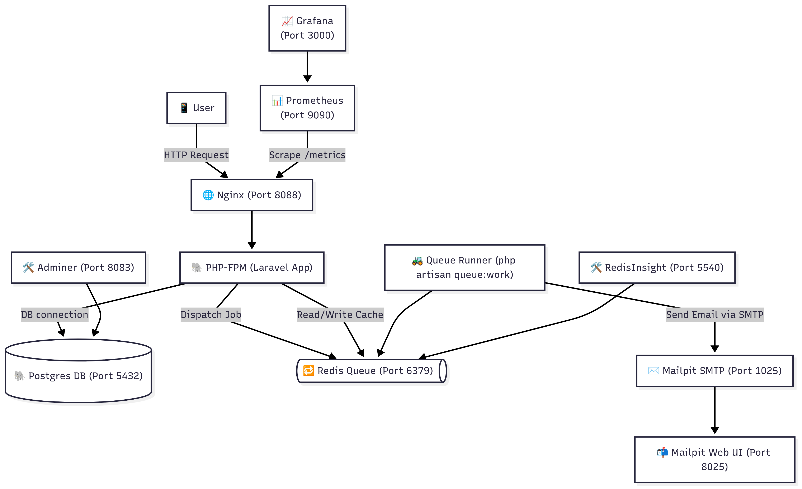
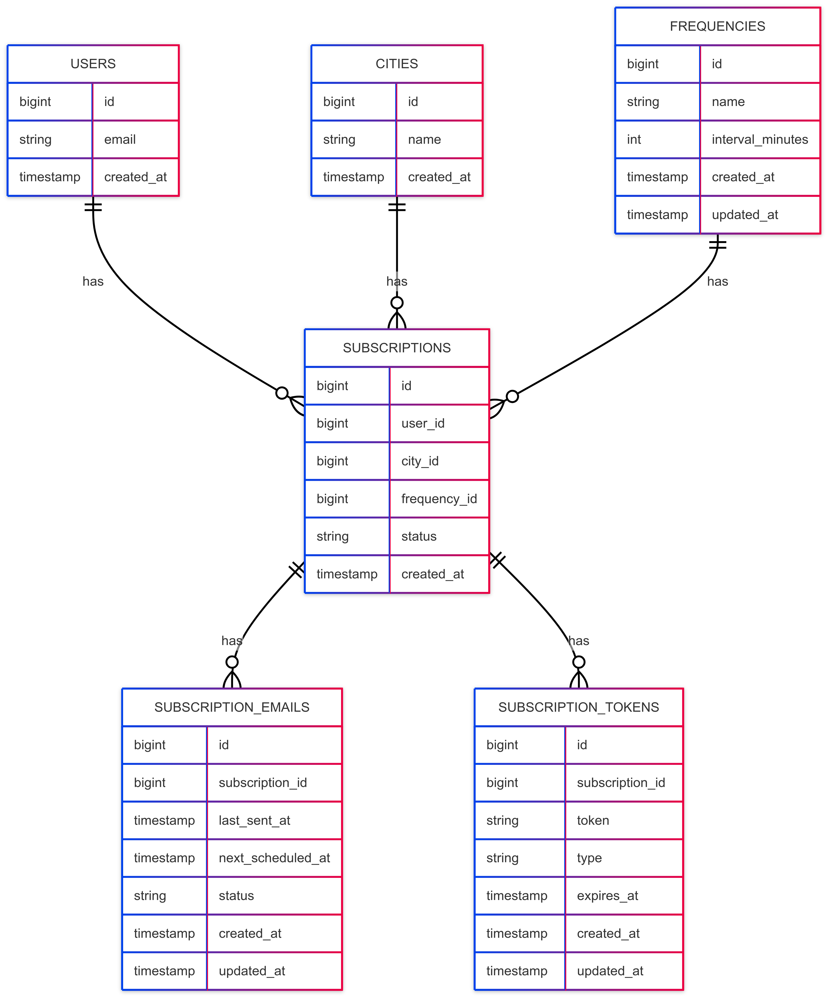

# System Design Document: Weather Subscription API

## 1. Requirements

### Functional Requirements
- Get weather for a requested city
- Subscribe for weather updates for a city with a chosen frequency (hourly/daily)
- Confirm subscription to the weather updates
- Unsubscribe from weather updates for a city and frequency
- Send weather updates via email based on the chosen frequency (hourly/daily)

### Non-functional Requirements
- **Usability**: Simple web interface and API for easy interaction
- **Availability**: 99.9% uptime expected via container orchestration
- **Latency**: API responses should be under 300ms for 95% of requests
- **Security**: Email confirmation for subscriptions; token-based request validation

### Constraints
- **Budget**: Runs on a small-scale server (Docker-based local/production setup)
- **External API Rate Limits**: [WeatherAPI](https://www.weatherapi.com/my) rate limit must be respected;
- **Compliance**: GDPR-compliant email management and opt-out features

---

## 2. Load Estimation

### Assumptions

- **Active Users**: 1,000
- **Subscriptions/User**: 2 → 2,000 subscriptions total
- **Cities**: 200
- **Frequencies**: Daily (1x/day) and Hourly (24x/day)
- **Emails per subscription per send**: 1 (one email record stored per send)
- **Tokens per subscription**: 2 (confirm + cancel) — constant

---

### Data Storage Estimation (per month)

| Table                    | Base Rows  | Daily Frequency (×30) | Hourly Frequency (×720) | Estimated Size per Row | Size Daily Freq | Size Hourly Freq |
|-------------------------|------------|-----------------------|------------------------|-----------------------|----------------|-----------------|
| **users**               | 1,000      | 1,000                 | 1,000                  | ~150 bytes            | ~150 KB        | ~150 KB         |
| **cities**              | 200        | 200                   | 200                    | ~80 bytes             | ~16 KB         | ~16 KB          |
| **frequencies**         | 5          | 5                     | 5                      | ~80 bytes             | ~0.5 KB        | ~0.5 KB         |
| **subscriptions**       | 2,000      | 2,000                 | 2,000                  | ~120 bytes            | ~240 KB        | ~240 KB         |
| **subscription_emails** | 2,000 × sends/month | 60,000 (2,000 × 30) | 1,440,000 (2,000 × 720) | ~150 bytes            | ~9 MB          | ~216 MB         |
| **subscription_tokens** | 4,000      | 4,000                 | 4,000                  | ~180 bytes            | ~700 KB        | ~700 KB         |

**Total Estimated DB Size**:
- Daily Frequency: ~10 MB
- Hourly Frequency: ~217 MB

---

### API and Email Traffic Estimation (per month)

| Metric                 | Daily Frequency       | Hourly Frequency          |
|------------------------|----------------------|---------------------------|
| Weather API calls      | 2,000 × 30 = 60,000   | 2,000 × 720 = 1,440,000   |
| Emails sent            | 60,000                | 1,440,000                 |
| Incoming data (approx) | ~500 MB               | ~12 GB                    |
| Outgoing emails + API  | ~1 GB                 | ~24 GB                    |

---

### Notes
- Storage size for emails grows linearly with sending frequency.
- API calls scale proportionally with the frequency of weather data fetches.
- Tokens remain constant since they're generated per subscription, not per send.

## 3. High-Level Architecture



- Web client interacts with the PHP backend API
- API uses Redis for caching and job queue
- Weather updates fetched from WeatherAPI
- Postgres as the main DB
- Mailpit used for email testing (Mail service abstraction for production)

---

## 4. Detailed Component Design

### 4.1 Database Design

<div style="display: flex; align-items: flex-start; gap: 20px;">
  
  <div>
  </div>
</div>

### 4.2 API Endpoints Design

| Endpoint                          | Method | Description |
|----------------------------------|--------|-------------|
| `/api/weather?city={name}`       | GET    | Fetch current weather |
| `/api/subscribe`                 | POST   | Submit subscription request |
| `/api/confirm?token={token}`     | GET    | Confirm subscription via token |
| `/api/unsubscribe?token={token}` | GET    | Cancel a subscription |

## 4.3 Validation Rules

#### `GET /api/weather`
**Query: `city`**
- Required: Yes
- Type: `string` (2–50 chars)

---

#### `POST /api/subscribe`
**Body parameters:**

- `email`:
    - Required: Yes
    - Format: valid email

- `city`:
    - Required: Yes
    - Type: `string` (2–50 chars)

- `frequency`:
    - Required: Yes
    - Allowed: `hourly`, `daily`

**Error response format:**
```json
{
  "success": false,
  "message": "Validation failed.",
  "errors": {
    "field": ["Error message"]
  }
}
```

---

#### `GET /api/confirm/{token}`

**Path parameter: `token`**
- Required: Yes
- Format: 64-character hexadecimal string
- Pattern: `^[0-9a-f]{64}$`

---

### `GET /api/unsubscribe/{token}`

**Path parameter: `token`**
- Required: Yes
- Format: 64-character hexadecimal string
- Pattern: `^[0-9a-f]{64}$`


### 4.4 Background Jobs (Queue)

- Redis queue is used to manage email sending
- Frequency-based scheduling: next email scheduled right after sending
- Subscriptions verified before sending (active status)

### 4.5 Token Handling

- Confirmation Token: Expires in 24h
- Cancellation Token: Permanent (should be sent with every weather updates email)
- Prevents duplicate subscriptions and expired confirmations

---

## 5. Deployment

### Environments
- **Development**: `docker-compose` in `/infra/dev`
- **Production**: Optimized container build via `/infra/prod`

### Dependencies
- PHP + Laravel
- Postgres
- Redis
- Mailpit (for local email testing)
- Adminer (DB access)
- RedisInsight (Queue inspection)

---

## 6. Testing Strategy

### Manual Testing
- Via Swagger/Postman using `openapi.yaml`

### Automated Testing
- Unit + Feature tests integrated via Laravel test suite

### Email Testing
- Mailpit (http://localhost:8025)

---

## 7. Monitoring and Maintenance

- RedisInsight for queue health
- Adminer for DB inspection
- Application logs monitored via Docker logging

---

## 8. Security

- Confirmation required before email delivery
- Tokens are securely generated and stored in the database
- Rate-limiting and validation for API endpoints

---

## 9. Future Enhancements

- Multi-language support for emails
- UI dashboard for managing subscriptions
- Weather history per user
