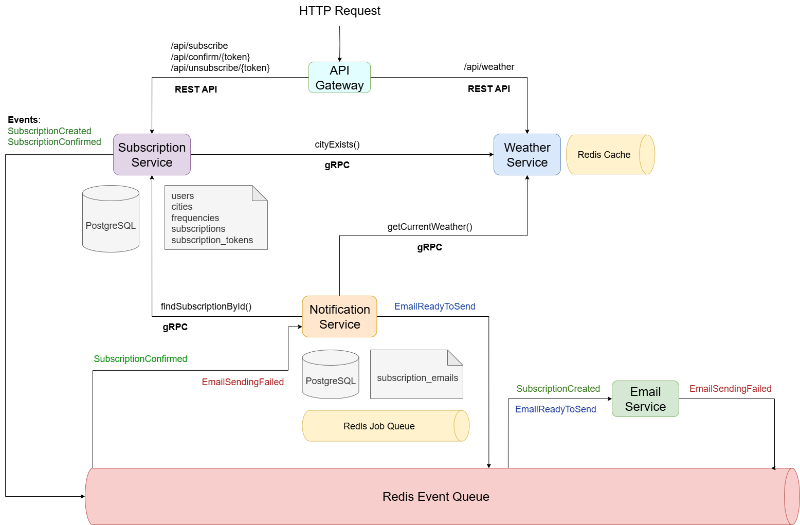

# ADR-002 Choose types for microservices communication

### Status: on review
### Date: 06.07.2025
### Author: Olha Dziuhal

For the current system, I suggest to select different communication approaches based 
on the specific needs of each interaction pattern.

The internal communication between the _Subscription Service_ and _Weather Service_ uses **gRPC** 
because these services need to exchange data frequently and efficiently. 
The **binary protocol** significantly reduces network overhead compared to JSON over HTTP, 
which is crucial when making multiple weather lookups. Additionally, 
gRPC's **type-safe contracts** through protocol buffers help prevent runtime errors 
and ensure reliable communication between services that need to work together seamlessly.

For the external _API Gateway_, I chose **REST** because it provides the most accessible 
interface for clients. Any web application, mobile app, or third-party integration can 
easily consume REST APIs using standard HTTP libraries without requiring special client implementations. 
This approach maximizes **compatibility** and makes the system easy to integrate with existing applications.

The asynchronous communication for notifications leverages **Redis event queues** to **decouple** 
email processing from the main notification workflow. This design ensures that email delivery failures 
don't block other operations, and the system can handle **high-volume notification scenarios** efficiently. 
Redis provides the performance needed for real-time message processing while offering persistence options 
for reliability.

This **hybrid architecture** approach allows each communication method to excel in its specific context 
rather than forcing a single solution across all interactions. The result is a system that balances **performance,
reliability, and maintainability** while remaining straightforward to develop and operate.